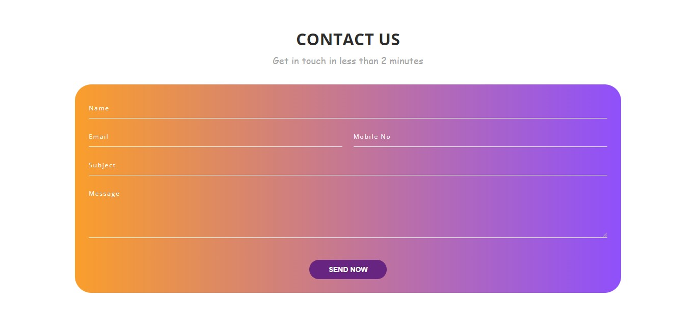

### Attractive Contact form

This repository contains the HTML and CSS code for an attractive and responsive contact form. The form is designed to be easy to use and visually appealing, with a focus on providing a smooth user experience.

#### Features:
* Clean and modern design
* Responsive layout
* Input validation
* Easy to customize

#### Installation:
1. Download or clone the repository to your local machine.
2. Open the `index.html` file in a web browser to view the contact form.
3. Customize the HTML and CSS code as needed.

#### Usage:
1.  Enter your contact information in the form fields.
2.  Click the "Send Now" button to submit the form.
3.  The form data will be submitted to the specified action URL.

#### Customization:
The HTML and CSS code can be easily customized to match your website's branding and design. You can change the colors, fonts, and layout of the form to create a unique look and feel.

#### Additional Notes:
* This contact form does not include server-side processing. You will need to set up your own server-side script to handle form submissions.
* The form includes basic input validation, but if you need more validation you can customize and add more to fit your needs.
